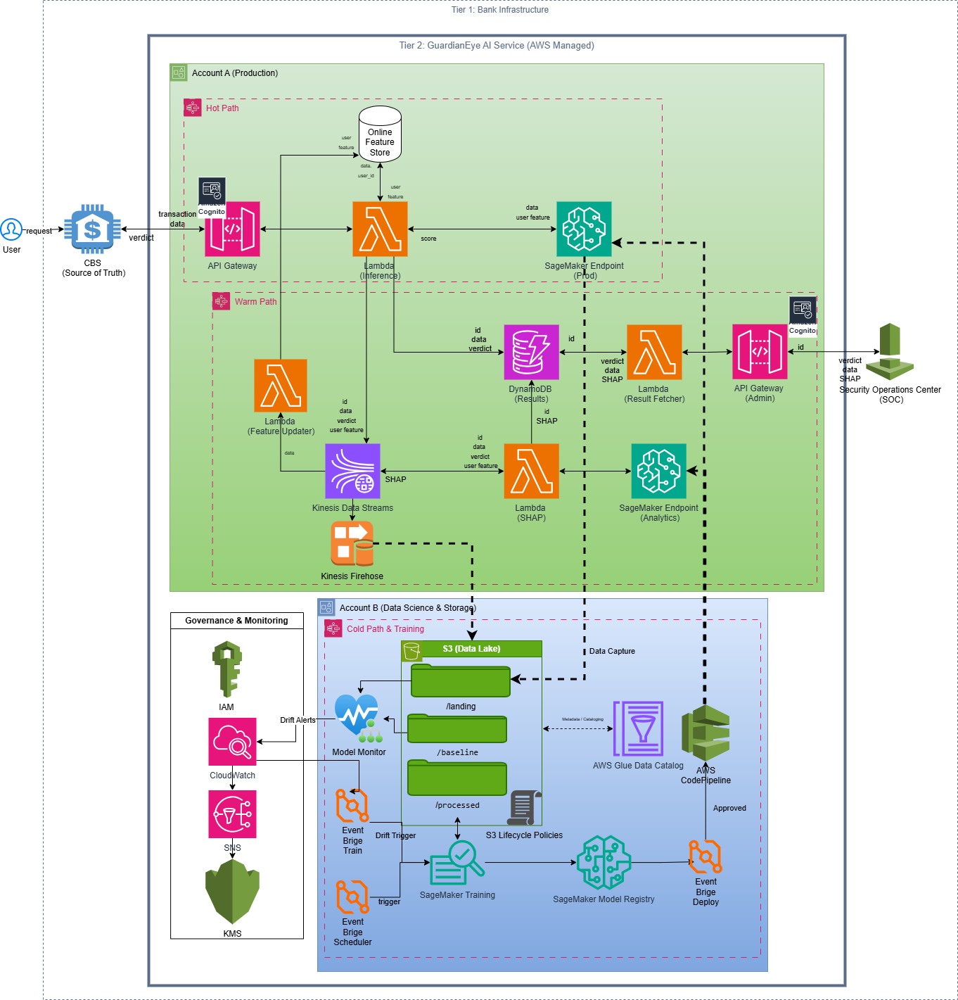

# GuardianEye AI (GE) — Intelligent Fraud Monitoring System

## 📌 Project Overview
GuardianEye AI is an advanced monitoring subsystem designed for real-time anomaly detection in banking transactions. It handles high-load traffic (up to 100,000 RPS) with low latency while ensuring high resiliency and explainability. 

## 🧭 How to use this repository

This is a conceptual architecture project focusing on high-level system design and MLOps integration. 
To explore the project effectively:
1. Start with the [Solution Design](SOLUTION_DESIGN.md) to understand the core architectural decisions and data paths.
2. Refer to the [Component Guide](COMPONENTS_GUIDE.md) for technical specifications of each AWS module.
3. Check the `images/` folder for the high-resolution architecture diagram.

## 📖 Documentation
* [Detailed Solution Design & Architectural Justification](SOLUTION_DESIGN.md) — A deep dive into the architectural decisions, data paths (Hot/Warm/Cold), and MLOps strategy.

## 🏗 System Architecture
The system is built on a multi-account AWS strategy to isolate production traffic from the ML research environment. 

### Key Architecture Paths:
* **Hot Path (<100ms):** Synchronous transaction scoring using AWS Lambda, SageMaker Endpoints, and Online Feature Store. 
* **Warm Path:** Asynchronous feature updates and SHAP explainability calculation via Kinesis Data Streams and DynamoDB. 
* **Cold Path:** Long-term storage in S3 Data Lake with Glue for historical analysis and model retraining. 

## 🛠 Tech Stack
* **Cloud:** AWS (Lambda, S3, DynamoDB, Kinesis, SageMaker, EventBridge) 
* **Security & Governance:** AWS Cognito, IAM, KMS, CloudWatch 
* **Core:** Python, FastAPI, MLOps Pipelines 

## 🚀 MLOps & Resiliency
* **Automated Retraining:** Triggered by EventBridge based on Model Monitor drift alerts. 
* **Governance:** Full audit trail and encryption at rest/transit.
